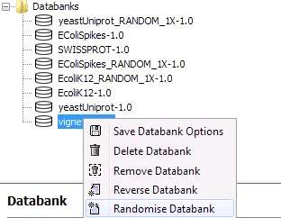
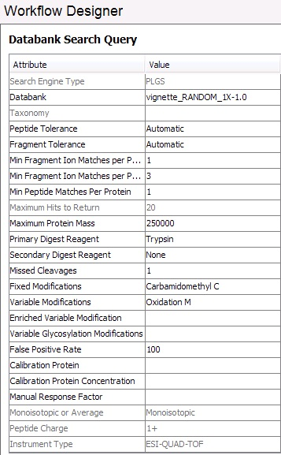

```{r environment, echo=FALSE}
suppressPackageStartupMessages(library("synapter"))
suppressPackageStartupMessages(library("synapterdata"))
suppressPackageStartupMessages(library("BiocStyle"))
suppressPackageStartupMessages(library("qvalue"))
## preparing some data
data(ups25b)  ## from synapterdata
res <- ups25b ## for synergise and plotRt
```

```{r include_forword, child="Foreword.md"}
```

```{r include_bugs, child="Bugs.md"}
```

# Introduction{#sec:intro}

## Background{#sec:bkg}

The main functionality of `r Biocpkg("synapter")` is to combine proteomics
data acquired under different mass spectrometry settings or with
different samples to (i) optimise the respective qualities of the two
data sets or (ii) increase the number of identifications, thereby
decreasing missing values. Besides `r Biocpkg("synapter")` offers other
functionality inaccessible in the default pipeline, like peptide FDR estimation
and filtering on peptide match type and peptide uniqueness.

The example that motivated the development of this package was to
combine data obtained on a Synapt G2 instrument:

1. HDMS$^E$ data, acquired with additional peptide separation using an ion
   mobility cell, thus leading to better (both in number and in quality)
   identification and
2. standard MS$^E$ data (acquired without ion mobility separation),
   providing better data quantitation.

The former is data is called *identification peptides* and the
latter *quantitation peptides*, irrespective of the acquisition
mode (HDMS$^E$ or MS$^E$). This HDMS$^E$/MS$^E$ design is used in this
document to illustrate the `r Biocpkg("synapter")` package.

However, although HDMS$^E$ mode possesses superior identification and
MS$^E$ mode superior quantitation capabilities and transferring
identifications from HDMS$^E$ to MS$^E$ is a priori the most efficient
setup, identifications can be transferred between any runs,
independently of the acquisition mode. This allows to reduce the
number of missing values, one of the primary limitation of label-free
proteomics. Thus users will benefit from `r Biocpkg("synapter")`'s
functionality even if they run their instruments in a single mode
(HDMS$^E$ or MS$^E$ only).

However, as will be shown in section [Data analysis](\#sec:analysis),
transferring identifications from multiple runs to each other increases analysis
time and peptide FDR within the analysis. `r Biocpkg("synapter")` allows
to minimise these effects to acceptable degree by choosing runs to
transfer identifications from and merging them in the *master*
HDMS$^E$ file.

This data processing methodology is described in section
[HDMS$^E$/MS$^E$ data analysis](\#sec:synapter) and the analysis pipeline is
described in section [Different pipelines](\#sec:pipelines).

To maximise the benefit of combining better identification and
quantitation data, it is also possible to combine several, previously
merged identification data files into one *master* set. This
functionality is described in section
[Using *master* peptide files](\#sec:master).

Finally, section [Analysis of complex experiments](\#sec:msnbase) illustrates
a complete pipeline including `r Biocpkg("synapter")` and
`r Biocpkg("MSnbase")` [@Gatto2012] packages to perform protein label-free
quantitation: how to combine multiple `r Biocpkg("synapter")` results to
represent the complete experimental design under study and further explore the
data, normalise it and perform robust statistical data analysis inside the
R environment.

The rationale underlying `r Biocpkg("synapter")`'s functionality are
described in [@Shliaha2013] and [@Bond2013].  The first
reference describes the benefits of ion mobility separation on
identification and the effects on quantitation, that led to the
development of `r Biocpkg("synapter")`, which in described and
demonstrated in [@Bond2013].

`r Biocpkg("synapter")` is written for R~[@R], an open source, cross
platform, freely available statistical computing environment and
programming language^[https://www.r-project.org/]. Functionality
available in the R environment can be extended though the usage of
packages. Thousands of developers have contributed packages that are
distributed via the Comprehensive R Archive Network (CRAN) or through
specific initiatives like the Bioconductor^[https://www.bioconductor.org/]
project [@Gentleman2004], focusing on the analysis and comprehension of
high-throughput biological data.

`r Biocpkg("synapter")` is such an R package dedicated to the analysis of
label-free proteomics data. To obtain detailed information about any
function in the package, it is possible to access it's documentation
by preceding it's name with a question mark at the command line
prompt. For example, to obtain information about the
`r Biocpkg("synapter")` package, one would type `?synapter`.

## Installation{#sec:install}

`r Biocpkg("synapter")` is available through the Bioconductor
project. Details about the package and the installation procedure can
be found on its page^[https://bioconductor.org/packages/synapter/]. Briefly,
installation of the package and all its dependencies should be done
using the dedicated Bioconductor infrastructure as shown below:

```{r install,  eval=FALSE}
source("https://bioconductor.org/biocLite.R")
## or, if you have already used the above before
library("BiocInstaller")
## and to install the package
biocLite("synapter")
```

After installation, `r Biocpkg("synapter")` will have to be explicitly loaded with

```{r library,  eval=FALSE}
library("synapter")
```

so that all the package's functionality is available to the user.


# Data analysis using `r Biocpkg("synapter")`{#sec:analysis}

## Preparing the input data{#sec:input}

Preparation of the data for `r Biocpkg("synapter")` requires the
`.raw` data first to be processed with Waters' ProteinLynx
Global Serve (PLGS) software. The *PLGS* result is then exported as
`csv` spreadsheet files in user specified folders. These
`csv` files can then be used as input for `r Biocpkg("synapter")`.

We also highly recommend users to acquaint themselves with the PLGS
search algorithm for data independent acquisitions [@PLGS2009].

First the user has to specify the output folders for files to be used
in synapter analysis as demonstrated in the figures. After
the folders are specified ignore the message that appears requiring
restarting PLGS.

{#fig:plgs1}
{#fig:plgs2}
{#fig:plgs3}

At the first stage *PLGS* performs noise reduction and centroiding,
based on user specified preferences called *processing parameters*.
These preferences determine thresholds in intensity for
discriminating between noise peaks and peptide and fragment ion peaks
in high and low energy functions of an acquisition. The optimal value
of these parameters is sample dependant and different between MS$^E$
and HDMS$^E$ modes. For `r Biocpkg("synapter")` to function properly all
acquisitions in the analysis have to be processed with the same
thresholds, optimal for the mode identifications are transferred from
(typically HDMS$^E$ mode). The user is expected to identify optimal
parameters himself for every new sample type by repeatedly analysing a
representative acquisition with different thresholds.

After the ions peaks have been determined and centroided, the ions
representing charge states and isotopes of a peptide are collapsed
into a single entity called EMRT (exact mass retention time pair). The
EMRTs in low energy function represent unidentified peptides and are
assigned peptides sequences during database search. The total list of
EMRTs can be found in the `pep3DAMRT.csv` file and it is one of
the `r Biocpkg("synapter")` input files for the runs used for quantitation
(typically MS$^E$ mode)

Prior to the database search, randomised entries are added to the
database to allow *PLGS* to compute *protein false positive rate*.
The randomised entries can either be added automatically or
manually, using the *Randomise Databank* function in the
*Databank admin tool*. To properly prepare the files for
`r Biocpkg("synapter")`, the user has to add randomised entries manually
via *Databank admin tool*, since only then randomised entries
identified in the database search will be displayed in the
*csv* output. The following figures demonstrate how to create
a randomised databank manually using one randomised entry per regular
entry.

{#fig:plgs4}
{#fig:plgs5}

The user is also expected to use a minimum of 1 fragment per peptide,
3 fragments per protein and 1 peptide per protein identification
thresholds and 100\%
*False Positive Rate*^[This is erroneously termed false positive rate in the software and manuscript and should be considered a false discovery rate.]
for protein identification during database search for all of the
acquisitions in the analysis as demonstrated in [figure](\#fig:plgs3).
This allows to maximise the number of identified
peptides from the randomised part of the database, needed to estimate
peptide identifications statistics. The total list of identified
peptides is given in `final_peptide.csv` files. A single
`final_peptide.csv` file has to be supplied to
`r Biocpkg("synapter")` for every run in the analysis (for both
identification and quantitation runs).

More details and screenshots are available in a separate document
available at https://lgatto.github.com/synapter/.

## HDMS$^E$/MS$^E$ data analysis{#sec:synapter}

The analysis of pairs of HDMS$^E$ and MS$^E$ data files is based on
the following rationale -- combine strengths or each approach by
matching high quality HDMS$^E$ identifications to quantified MS$^E$
EMRTs applying the following algorithm:

1. Apply various peptide filters to HDMS$^E$ and MS$^E$ peptides to obtain two
   sets of reliably identified unique proteotypic peptides.
2. Use shared HDMS$^E$ and MS$^E$ peptides to model the deviations in retention
   time between the two mass spectrometer runs.
3. Optimise the parameters that will be used to optimally match all HDMS$^E$
   peptides and quantified MS$^E$ EMRTs using a grid search.
4. Using the best parameters, match identified HDMS$^E$ peptides to quantified
   MS$^E$ EMRTs.

## Different pipelines{#sec:pipelines}

Two different pipeline are available to the user:

### Wrapper function

The `synergise` function is a high level wrapper that
implements a suggested analysis to combine two files (see next
paragraph for details). A set of parameters can be passed, although
sensible defaults are provided. While the analysis is executed, a html
report is created, including all result files in text spreadsheet
(`csv` format) and binary R output. This level allows easy
scripting for automated batch analysis. Using data from the
`r Biocexptpkg("synapterdata")` package, the following code chunk illustrates
the `synergise` usage. An example report can be found online at
https://lgatto.github.com/synapter/.

```{r prepare-synergise}
library("synapterdata")
hdmsefile <- getHDMSeFinalPeptide()[2]
basename(hdmsefile)
msefile <- getMSeFinalPeptide()[2]
basename(msefile)
msepep3dfile <- getMSePep3D()[2]
basename(msepep3dfile)
fas <- getFasta()
basename(fas)
## the synergise input is a (named) list of filenames
input <- list(identpeptide = hdmsefile,
              quantpeptide = msefile,
              quantpep3d = msepep3dfile,
              fasta = fas)
## a report and result files will be stored
## in the 'output' directory
output <- tempdir()
output
```
<!--
Not evaluating this bit because it increases
the vignette build/check over the 5 minutes
Bioconductor limit (build is 5 min, check is 12 min)
-->
```{r synergise, eval=FALSE}
res <- synergise(filenames = input, outputdir = output)
```

<!-- res ups25b from synapterdata -->
```{r performance}
performance(res)
```

See `?synergise` for details.

### Detailed step-by-step analysis

The user can have detailed control on each step of the analysis by
executing each low-level function manually. This pipeline, including
generation of data containers (class instances) and all available
operations are available in `?Synapter`. This strategy
allows the maximum flexibility to develop new unexplored approaches.

## Using *master* peptide files{#sec:master}

While analysing one MS$^E$ file against one single HDMS$^E$ file
increased the total number of reliably identified and quantified
features compared to each single MS$^E$ analysis, a better procedure
can be applied when replicates are available. Consider the following
design with two pairs of files: HDMS$^E_1$, MS$^E_1$, HDMS$^E_2$ and
MS$^E_2$. The classical approach would lead to combining for example,
HDMS$^E_1$ and MS$^E_1$ and HDMS$^E_2$ and MS$^E_2$. However,
HDMS$^E_1$ -- MS$^E_2$ and HDMS$^E_2$ -- MS$^E_1$ would also be
suitable, possibly leading to new identified and quantified
features. Instead of repeating all possible combinations, which could
hardly be applied for more replicates, we allow to merge HDMS$^E_1$
and HDMS$^E_2$ into a new *master* HDMS$^E_{12}$ and then using
it to transfer identification to both MS$^E$ runs. In addition to
leading to a simpler set of analyses, this approach also allows to
control the false positive rate during the HDMS$^E$ merging (see
section [Choosing HDMS$^E$ files](\#sec:whichhdmse)).
Such *master* HDMS$^E$ files can be readily created with the
`makeMaster` function, as described in section
[Generating a *master file*](\#sec:makeMaster).

We will use data from the `r Biocexptpkg("synapterdata")` to illustrate how to
create *master* files.


### Choosing which HDMS$^E$ files to combine{#sec:whichhdmse}

In a more complex design, a greater number of HDMS$^E$ files might
need to be combined. When combining files, one also accumulates false
peptides assignments. The extent to which combining files increases
new reliable identification at the cost of accumulating false
assignments can be estimated with the `estimateMasterFdr`
function.

To illustrate how FDR is estimated for *master* HDMS$^E$ files,
let's consider two extreme cases.

- In the first one, the two files (each with $1000$ peptides
  filtered at an FDR of $0.01$) to be combined are nearly identical,
  sharing $900$ peptides. The combined data will have $900 (shared) +
  2 \times 100 (unique)$ peptides and each file, taken separately is
  estimated to have $1000 \times 0.01 = 10$ false positive
  identifications. We thus estimate the upper FDR bound after merging
  the two files to be $\frac{20}{1100} = 0.0182$.

- In the second hypothetical case, the two files (again each with
  $1000$ peptides filtered at a FDR of $0.01$) to be combined are very
  different and share only $100$ peptides. The combined data will have
  $100 (shared) + 2 \times 900 (unique)$ peptides and, as above, each
  file is estimated to have $10$ false discoveries. In this case, we
  obtain an upper FDR bound of $\frac{20}{1900} = 0.0105$.

In general, the final false discovery for two files will be
$$FDR_{master} = \frac{nfd_{1} + nfd_{2}}{union(peptides~HDMS$^E_{1}, peptides~HDMS$E_{2})}$$

where $nfd_{i}$ is the number of false discoveries in HDMS$^E$ file
$i$. Note that we do not make any assumptions about repeated
identification in multiple files here.

`estimateMasterFdr` generalised this for any number of
HDMS$^E$ files and indicates the best combination at a fixed
user-specified `masterFdr` level. Mandatory input is a list of
HDMS$^E$ file names and a fasta database file name to filter
non-unique proteotypic peptides.

```{r inputfiles, echo=FALSE, eval=TRUE}
inputfiles <- getHDMSeFinalPeptide()
```

The result of `estimateMasterFdr` stores the number of
unique proteotypic peptides and FDR for all possible
`r sum(choose(length(inputfiles),2:length(inputfiles)))`
combinations of `r length(inputfiles)` files. A summary can be
printed on the console or plotted with `plot(cmb)` (see
figure [1](\#fig:estimateFdrPlot)).

```{r masterFdr, cache=TRUE}
## using the full set of 6 HDMSe files and a
## fasta database from the synapterdata package
inputfiles <- getHDMSeFinalPeptide()
fasta <- getFasta()
cmb <- estimateMasterFdr(inputfiles, fasta, masterFdr = 0.02,
                         verbose = FALSE)
cmb
```

```{r estimateFdrPlot, fig.cap="Figure illustrating the relation between the number of unique peptides in the combined HDMS$^E$ file and the resulting false discovery rate. The symbols on the figure represent the number of files for that particular combination. The dotted line is the user defined threshold for the combined FDR (`masterFdr` parameter). The best combination, i.e the one that maximises the number of unique peptides while keeping the FDR below `masterFdr` is highlighted in red."}
plot(cmb)
```

The best combination can be extracted with the `bestComb` function.

```{r bestComb}
bestComb(cmb)
```

See `?estimateMasterFdr` and references therein for more
details about the function and the returned object.

### Generating a *master file*{#sec:makeMaster}

Now that we have identified which files should be used to create the
master file, we can directly pass the relevant identification files to
the `makeMaster` function to generate the *master*
file.  The function has one mandatory input parameter,
`pepfiles`, a list oh identification file names to be
merged. The output is an object of class `MasterPeptides` that
stores the relevant peptides from the original input files. The result
can be saved to disk using `saveRDS` for further analysis,
as described in section [HDMS$^E$/MS$^E$ data analysis](\#sec:synapter).

```{r master, cache=TRUE, warning=FALSE}
master <- makeMaster(inputfiles[bestComb(cmb)], verbose = FALSE)
master
```

More details can be found in the function documentation accessible
with `?makeMaster`.

## Summary

Two functions are needed to choose a set of identification run files and
create the *master* identification run. One function enables to perform a
complete identification transfer. The following table
summarises all there is to know to utilise `r Biocpkg("synapter")`'s functionality.

Function             Description
-------------------  --------------------------------------------------------
`synapterGUI()`      Opens the graphical user interface
`synergise`          Runs the complete identification transfer
`estimateMasterFdr`  Chooses which files to be used to create the *master* IR
`makeMaster`         Creates the *master* IR

# Analysing complete experiments{#sec:msnbase}

The functionality described in this section relies on the
`r Biocpkg("MSnbase")` package [@Gatto2012], which is installed by
default with `r Biocpkg("synapter")`. Please refer to the
`r Biocpkg("MSnbase")` Bioconductor web page.
the associated vignettes and the respective manual pages for more
details.

The `r Biocexptpkg("synapterdata")` already provides preprocessed *PLGS*
data. Six `Synapter` instances are available: 3 replicates
(labelled `a`, `b` and `c`) of the Universal Proteomics Standard (UPS1)
48 protein mix at 25 fmol and 3 replicates at 50 fmol,
in a constant *E. coli* background.
The 6 files can be loaded in your working space with

```{r loadups}
data(ups25a, ups25b, ups25c, ups50a, ups50b, ups50c)
```

## Applying the *Top 3* approach{#sec:top3}

We will start by describing the analysis of `ups25a` in
details, and then show how to analyse all the runs using more compact
code. The first step of our analysis is to convert the
`r Biocpkg("synapter")` object output (an `Synapter` instance),
into a `r Biocpkg("MSnbase")`-compatible object, called an
`MSnSet`, that we will name `ms25a`. We can obtain a description of the
`MSnSet` object by typing its name.

```{r setas}
ms25a <- as(ups25a, "MSnSet")
class(ups25a)[1]
class(ms25a)[1]
ms25a
```

It contains quantitation information about `r nrow(ms25a)` peptides for
`r ncol(ms25a)` sample. In the code chunk below, we update the default sample
name `Synapter1` with a more meaningful one.

```{r updatesamplename}
sampleNames(ms25a)
sampleNames(ms25a) <- "ups25a"
sampleNames(ms25a)
```

Quantitative data and meta-data, which has been acquired by
`r Biocpkg("synapter")`, can be extracted with the `exprs` and
`fData` methods.

```{r accessor}
tail(exprs(ms25a))
tail(fData(ms25a)[, c(2,9)])
## all fetaure metadata
fvarLabels(ms25a)
```

We will describe a how to process the data using a *Top 3*
approach, where the 3 most intense peptides of each protein are used
to compute the protein intensity, using the `topN` and
`combineFeatures` methods. The former allows to extract the
top most intense peptides (default `n` is 3) and remove all
other peptides from the `MSnSet` object. The latter than
aggregates the `n` most intense peptides per protein using a
user-defined function (`sum`, below). Finally, we also scale
protein intensity values depending on the actual number of peptides
that have summed. This number of quantified peptides can be calculated
(after `topN`, but before `combineFeatures`) with
`nQuants`.

```{r dotop3}
ms25a <- topN(ms25a,
              groupBy = fData(ms25a)$protein.Accession,
              n = 3)
nPeps <- nQuants(ms25a,
                 groupBy = fData(ms25a)$protein.Accession)
ms25a <- combineFeatures(ms25a,
                         fData(ms25a)$protein.Accession,
                         "sum", na.rm = TRUE,
                         verbose = FALSE)
head(exprs(ms25a))
head(nPeps)
## scale intensities
exprs(ms25a) <- exprs(ms25a) * (3/nPeps)
## NaN result from the division by 0, when
## no peptide was found for that protein
head(exprs(ms25a))
```

## Batch processing{#sec:batchprocessing}

The code chunk below repeats the above processing for the other 5 UPS1/*E. coli* runs.

```{r batch}
nms <- c(paste0("ups", 25, c("b", "c")),
         paste0("ups", 50, c("a", "b", "c")))
tmp <- sapply(nms, function(.ups) {
  cat("Processing", .ups, "... ")
  ## get the object from workspace and convert to MSnSet
  x <- get(.ups, envir = .GlobalEnv)
  x <- as(x, "MSnSet")
  sampleNames(x) <- .ups
  ## extract top 3 peptides
  x <- topN(x, groupBy = fData(x)$protein.Accession, n = 3)
  ## calculate the number of peptides that are available
  nPeps <- nQuants(x, fData(x)$protein.Accession)
  ## sum top3 peptides into protein quantitation
  x <- combineFeatures(x, fData(x)$protein.Accession,
                       "sum", na.rm = TRUE, verbose = FALSE)
  ## adjust protein intensity based on actual number of top peptides
  exprs(x) <- exprs(x) * (3/nPeps)
  ## adjust feature variable names for combine
  x <- updateFvarLabels(x, .ups)
  ## save the new MSnExp instance in the workspace
  varnm <- sub("ups", "ms", .ups)
  assign(varnm, x, envir = .GlobalEnv)
  cat("done\n")
})
```

We now have 6 `MSnSet` instances, containing protein
quantitation for the 6 UPS/*E. coli* runs.

## Combining data and filtering

We now want to filter data out based on missing quantitation data,
retaining proteins that have been quantified in at a least two out of
three replicates. Filtering based on missing data can be done using
the `filterNA` method and a maximum missing data content as
defined by `pNA`. Multiple `MSnSet` instances can be
combined with the `combine` method, which is described in
details in the `MSnbase-demo` vignette^[The vignette is accessible from within R with `vignette("MSnbase-demo" package = "MSnbase")`.].
The 6 objects have appropriate distinct
sample names and common feature (protein) names, which will be used to
properly combine the quantitation data.

```{r combine25, echo=TRUE}
ms25 <- combine(ms25a, ms25b)
ms25 <- combine(ms25, ms25c)
dim(ms25)
ms25 <- filterNA(ms25, pNA = 1/3)
dim(ms25)
```

Once combined and filtered, the 25 fmol group retains
`r nrow(ms25)` entries with at least 2 out of 3 quantitation
values, out of the `r nrow(ms25a)` total number of proteins.

```{r combine50}
ms50 <- combine(ms50a, ms50b)
ms50 <- combine(ms50, ms50c)
dim(ms50)
ms50 <- filterNA(ms50, pNA = 1/3)
dim(ms50)
```

Similarly, the 50 fmol group retains `r nrow(ms50)` entries with
at least 2 out of 3 quantitation values, out of the
`r nrow(ms50a)` initial proteins.

We now combine the two subgroups into one `MSnSet` object that
contains all 6 samples and filter for proteins that are observed in
both groups, i.e retaining proteins with a maximum of 2/6 missing
values. We also compute a summary table with the number of protein
that have 4, 5, or 6 quantitation values across the 6 samples.

```{r msUps}
msUps <- combine(ms25, ms50)
msUps <- filterNA(msUps, pNA = 2/6)
head(exprs(msUps))
table(apply(exprs(msUps), 1,
            function(.x)sum(!is.na(.x))))
```

We obtain a final data set containing `r nrow(msUps)` proteins.
Finally, we normalise protein intensities in each sample to
correct for experimental loading biases and pipetting errors. To do
so, we compute 6 sample medians using all constant *E. coli*
background proteins and divide each protein by its respective sample
mean.

```{r scale}
ecoli <- -grep("ups$", featureNames(msUps))
meds <- apply(exprs(msUps)[ecoli, ], 2,
              median, na.rm=TRUE)
exprs(msUps) <- t(apply(exprs(msUps), 1,
                        "/", meds))
```

This same procedure could be applied with a set of constant spikes to
estimate absolute protein quantities.

## Statistical analysis of differentially expressed proteins

The UPS1 spiked-in protein mix is composed of 48 proteins,
`r length(grep("ups", featureNames(msUps)))` of which have been
observed and quantified in our final data object. In this section, we
will illustrate how to analyse the `r nrow(msUps)` proteins to
extract those that show differences between the two groups and show
that these candidates represent the UPS1 spikes.

The R environment and many of the available packages allow extremely
powerful statistical analysis. In this document, we will apply a
standard t-test on $log_2$ transformed data for convenience, to
calculate p-value for individual proteins (`pv` variable
below). For best performance with small number of samples and more
complex designs, we recommend the Bioconductor `r Biocpkg("limma")`
package [@limma]. We then perform multiple comparison adjustment using the
`qvalue` from the `r Biocpkg("qvalue")` package, that implements
the method from [@Storey2003] (`qv` variable below). The
`r Biocpkg("multtest")` package provides several other p-value adjustment
methods. We will also compute $log_2$ fold-changes and illustrate the
results on a volcano plot (figure [2](\#fig:volcano)). Figure
[3](\#fig:hmap) illustrates the UPS1 proteins and samples on a
classical heatmap.

```{r stats}
## use log2 data for t-test
exprs(msUps) <- log2(exprs(msUps))
## apply a t-test and extract the p-value
pv <- apply(exprs(msUps), 1 ,
            function(x)t.test(x[1:3], x[4:6])$p.value)
## calculate q-values
library("qvalue")
qv <- qvalue(pv)$qvalues
## calculate log2 fold-changes
lfc <- apply(exprs(msUps), 1 ,
             function(x) mean(x[1:3], na.rm=TRUE)-mean(x[4:6], na.rm=TRUE))
## create a summary table
res <- data.frame(cbind(exprs(msUps), pv, qv, lfc))
## reorder based on q-values
res <- res[order(res$qv), ]
knitr::kable(head(round(res, 3)))
```

In the above example, quantitation values and statistics data are
saved in a summary dataframe (`res`), that can be exported to
a comma-separated spreadsheet with

```{r writecsv, eval=FALSE}
write.csv(res, file = "upsResults.csv")
```

```{r volcano, fig.cap="Volcano plot. On the volcano plot, each protein is represented by a dot and positioned according to its $log_2$ fold-change along the x axis and $-log_{10}$ of its q-value along the y axis. Proteins with large fold-changes are positioned on the sides of the plot, while proteins with low q-values are at the top of the figure. The most promising candidates are this located on the top corners. In our case, the UPS proteins (in blue) have $log2$ fold-changes around -1 (vertical dotted line), as expected. The horizontal dotted line represents a q-value threshold of 0.10."}
plot(res$lfc, -log10(res$qv),
     col = ifelse(grepl("ups$", rownames(res)),
       "#4582B3AA",
       "#A1A1A180"),
     pch = 19,
     xlab = expression(log[2]~fold-change),
     ylab = expression(-log[10]~q-value))
grid()
abline(v = -1, lty = "dotted")
abline(h = -log10(0.1), lty = "dotted")
legend("topright", c("UPS", "E. coli"),
       col = c("#4582B3AA", "#A1A1A1AA"),
       pch = 19, bty = "n")
```

```{r hmap, fig.keep="last", fig.cap="A heatmap of all UPS1 proteins present in the final data set."}
heatmap(exprs(msUps)[grep("ups",featureNames(msUps)), ])
```

```{r falsepos, echo=FALSE}
sel1 <- (res$qv < 0.1)
signms <- rownames(res)[sel1]
i <- grep("ups", signms)
n1 <- length(i)
n2 <- length(signms) - n1
```

```{r upstab, echo=FALSE, results='asis'}
k <- grep("ups", rownames(res))
knitr::kable(round(res[k, ], 3),
             caption = "UPS1 proteins.")
```

A total `r n1` proteins show a statistically different pattern
between the two groups, at a false discovery rate of 10\%.
Table [upstab](\#tab:upstab) summarises the results for all UPS1 proteins.

# Session information{#sec:sessionInfo}

All software and respective versions used to produce this document are
listed below.

```{r sessioninfo}
sessionInfo()
```

# References
