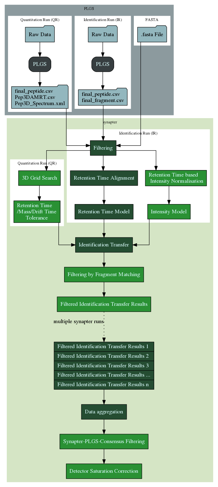

```{r environment, echo=FALSE}
suppressPackageStartupMessages(library("synapter"))
suppressPackageStartupMessages(library("synapterdata"))
suppressPackageStartupMessages(library("BiocStyle"))
data(synobj2)
```

```{r include_forword, child="Foreword.md"}
```

```{r include_bugs, child="Bugs.md"}
```

# Introduction

Here we describe the new functionality implemented in *synapter 2.0*. Namely
this vignette covers the utilisation of the new 3D grid search, the fragment
matching, intensity modeling and correction of detector saturation.

# Workflow

The *synapter2* workflow is similar to the old one in *synapter1*.
First it is necessary to use *PLGS* to create the *csv* (and *xml*) files.
Therefore we refer the reader to the default `r Biocpkg("synapter")` vignette,
available [online](https://bioconductor.org/packages/release/bioc/vignettes/synapter/inst/doc/synapter.html)
and with `vignette("synapter", package = "synapter")`.

In contrast to the original workflow the `final_fragment.csv` file for the
identification run and a `Spectrum.xml` file for the quantification run are
needed if the fragment matching should be applied.

Subsequently the original workflow is enhanced by the new [3D grid
search]{\#gridsearch} and the [intensity modeling]{\#intensitymodel}.
Afterwards the [fragment matching]{\#fragmentmatching} could be applied.
`r Biocpkg("MSnbase")`[@Gatto2012] is used for further analysis.
The new `r Biocpkg("synapter")` adds
[`r Biocpkg("synapter")`/*PLGS* consensus filtering]{\#synapterplgs}
and the [detector saturation correction]{\#saturation} for `MSnSet`s.



# Create a `Synapter` object

To demonstrate a typical step-by-step workflow we use example data
that are available on http://proteome.sysbiol.cam.ac.uk/lgatto/synapter/data/.
There is also an `synobj2` object in `r Biocexptpkg("synapterdata")` which
contains the same data.

The `Synapter` constructor uses a named `list` of input files. Please note that
we add `identfragments` (`final_fragment.csv`) and
`quantspectra` (`Spectrum.xml`) because we want to apply the fragment matching
later.

```{r create-synobj2-file, echo=FALSE, comment=NA}
cat(readLines(system.file(file.path("scripts", "create_synobj2.R"),
                          package="synapterdata")), sep = "\n")
```
```{r show-synobj2}
synobj2
```

# Filtering

The first steps in each `r Biocpkg("synapter")` analysis are filtering by
peptide sequence, peptide length, ppm error and *false positive rate*.

Here we use the default values for each method. But the accompanying plotting
methods should be used to find the best threshold:

```{r filtering}
filterUniqueDbPeptides(synobj2,
                       missedCleavages=0,
                       IisL=TRUE)
filterPeptideLength(synobj2, l=7)
plotFdr(synobj2)
filterQuantPepScore(synobj2, method="BH",
                    fdr=0.05)
filterIdentPepScore(synobj2, method="BH",
                    fdr=0.05)
par(mfcol=c(1, 2))
plotPpmError(synobj2, what="Ident")
plotPpmError(synobj2, what="Quant")
par(mfcol=c(1, 1))
filterQuantPpmError(synobj2, ppm=20)
filterIdentPpmError(synobj2, ppm=20)
plotPepScores(synobj2)
filterIdentProtFpr(synobj2, fpr=0.05)
filterQuantProtFpr(synobj2, fpr=0.05)
```

# Modeling retention time

Next we merge the identified peptides from the identification run and
quantification run and build a
[*LOWESS*](https://en.wikipedia.org/wiki/Local_regression) based retention time
model to remove systematic shifts in the retention times.
Here we use the default values but as stated above the plotting methods should
be used to find sensible thresholds.

```{r rtmodel}
mergePeptides(synobj2)

plotRt(synobj2, what="data")
setLowessSpan(synobj2, span=0.05)
modelRt(synobj2)

par(mfcol=c(1, 2))
plotRtDiffs(obj)
plotRt(obj, what="model", nsd=1)
par(mfcol=c(1, 1))

plotFeatures(synobj2, what="all", ionmobility=TRUE)
```

# Grid search{#gridsearch}

To find *EMRTS* (exact *m/z*-retention time pairs) we try are running a grid
search to find the best retention time tolerance and *m/z* tolerance that
results in the most correct one-to-one matching in the merged (already
identified) data.
If the identification and quantitation run are HDMS$^E$ data we could
use the new 3D grid search that looks for the best matching in the retention
time, *m/z* and ion mobility (drift time) domain to increase the accuracy.
If one or both datasets are MS$^E$ data it falls back to the traditional 2D grid
search.

```{r gridsearch}
searchGrid(synobj2,
           imdiffs=seq(from=0.6, to=1.6, by=0.2),
           ppms=seq(from=2, to=20, by=2),
           nsds=seq(from=0.5, to=5, by=0.5))
setBestGridParams(synobj2)
findEMRTs(synobj2)
plotEMRTtable(synobj2)
```

# Fragment matching

filterFragments(expl, what="fragments.ident", minIntensity=fm.ident.minIntensity)
filterFragments(expl, what="spectra.quant", minIntensity=fm.quant.minIntensity)
fragmentMatching(expl, ppm=fm.ppm)

fragmentMatchingStats <- fragmentMatchingPerformance(expl, what="non-unique")
sel <- which(fragmentMatchingStats[, "fdr"] < fm.fdr.nonunique)
nonUniqueThreshold <- min(fragmentMatchingStats[sel, "deltacommon"])

filterUniqueMatches(expl, minNumber=1)
filterNonUniqueMatches(expl, minDelta=nonUniqueThreshold)
filterNonUniqueIdentMatches(expl)

rescueEMRTs(expl, method="rescue")

# Modeling intensity

setLowessSpan(expl, span.int)
modelIntensity(expl)

# export

writeMergedPeptides(expl, file=file.path(outputDir, "explicit", "MergedPeptides.csv"))
writeMatchedEMRTs(expl, file=file.path(outputDir, "explicit", "MatchedPeptides.csv"))
writeIdentPeptides(expl, file=file.path(outputDir, "explicit", "IdentPeptides.csv"))
writeQuantPeptides(expl, file=file.path(outputDir, "explicit", "QuantPeptides.csv"))
saveRDS(expl, file=file.path(outputDir, "explicit", "SynapterObject.rds"))

# convert to MSnbase

# synapter/PLGS agreement

# detector saturation correction

# what we have done

getLog

# Functions not covered in this vignette

fragment library, multiple synapter runs

# Session information{#sec:sessionInfo}

All software and respective versions used to produce this document are
listed below.

```{r sessioninfo}
sessionInfo()
```

# References
